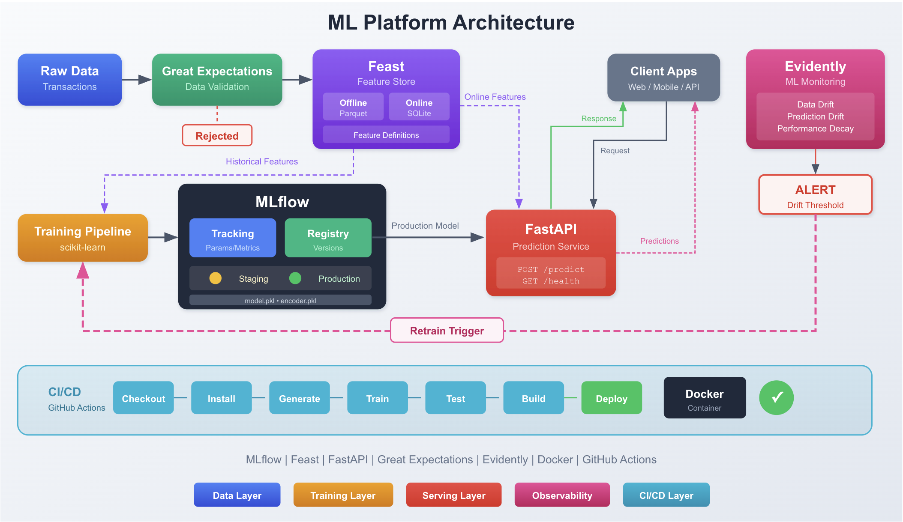
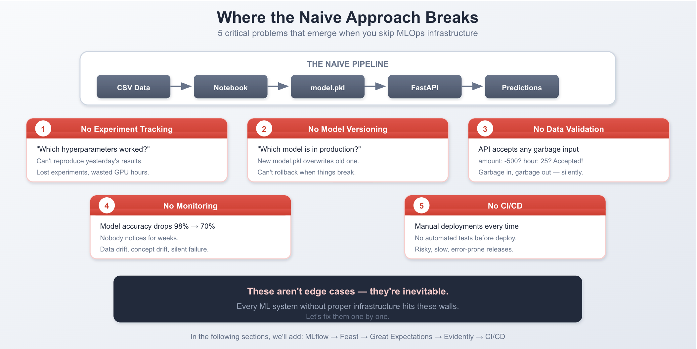
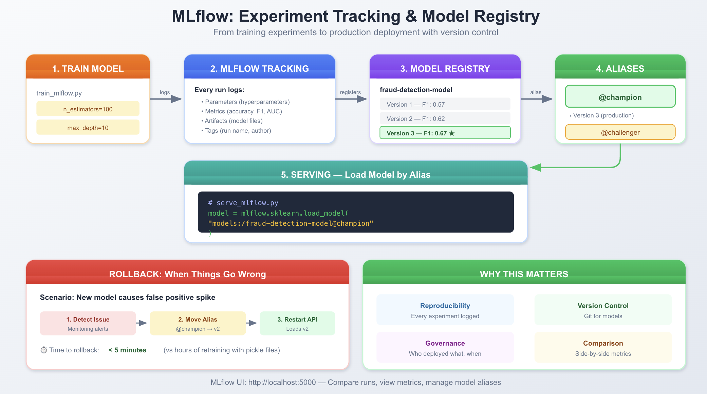

# End-to-End Local ML Platform

A credit card fraud detection system built by following the freeCodeCamp tutorial
[How to Build an End-to-End ML Platform Locally — From Experiment Tracking to CI/CD](https://www.freecodecamp.org/news/build-end-to-end-ml-platform-locally-from-experiment-tracking-to-cicd/#heading-project-overview-and-setup).

The point of the project isn't the model — it's everything around it. A notebook model is easy; making it reliable, reproducible, validated, and monitored is the hard part. This repo builds that "last mile" infrastructure entirely on a local machine.



## What I Learned

**1. Why naive pipelines break** (`src/train_naive.py`, `src/serve_naive.py`)
Started with a plain scikit-learn model behind FastAPI. It works — until you can't remember which run produced which model, features drift between training and serving, and garbage inputs silently produce garbage predictions.



**2. Experiment tracking with MLflow** (`src/train_mlflow.py`, `src/serve_mlflow.py`)
Every training run logs params, metrics, and artifacts to a local MLflow server (`mlflow.db`, `mlruns/`). The Model Registry versions models, so serving loads a named registered model instead of a random pickle file.



**3. Feature consistency with Feast** (`feature_repo/`, `src/feast_features.py`, `src/prepare_feast_features.py`)
Training/serving skew is one of the sneakiest ML bugs: features computed one way offline and another way online. Feast defines features once and serves the same values to both training (offline store) and the API (online store).

**4. Data validation with Great Expectations** (`src/data_validation.py`, `src/serve_validated.py`, `src/test_bad_data.py`)
Incoming requests are checked against an expectation suite before hitting the model. Bad inputs get rejected with a clear error instead of a confident-but-meaningless prediction.

**5. Drift monitoring with Evidently** (`src/monitoring.py`)
Models decay silently as real-world data shifts away from the training distribution. Evidently compares recent data against a reference set and produces a drift report ([drift_report.html](drift_report.html)) so decay is detected instead of discovered.

**6. CI/CD with pytest, Docker, and GitHub Actions** (`tests/`, `Dockerfile`)
Automated tests cover the API and the data/model behavior, and the service is containerized so it runs the same everywhere. The CI workflow runs the test suite on every push.

## Stack

| Tool | Role |
|------|------|
| scikit-learn | Fraud classification model |
| MLflow | Experiment tracking + model registry |
| Feast | Feature store (offline + online) |
| Great Expectations | Input data validation |
| Evidently | Data drift monitoring |
| FastAPI | Prediction API |
| Docker + GitHub Actions | Packaging and CI |

## Quickstart

```bash
python -m venv venv && venv\Scripts\activate   # Windows
pip install -r requirements.txt

python src/generate_data.py        # create synthetic fraud data
mlflow server --backend-store-uri sqlite:///mlflow.db --port 5000
python src/train_mlflow.py         # train + register model
uvicorn src.serve_validated:app --reload   # serve with validation
pytest tests/
```

## Credit

All concepts and architecture come from the freeCodeCamp handbook by the original author:
<https://www.freecodecamp.org/news/build-end-to-end-ml-platform-locally-from-experiment-tracking-to-cicd/#heading-project-overview-and-setup>
